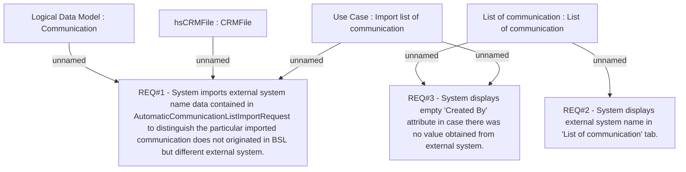

# CLM-733 (CBL-878) Change in GUI of communication history, showing ext. system attribute

- **Diagram Type**: Custom
- **Package**: HomerSelect/BSL/Requirements Model/Finished/CLM/CLM-733 (CBL-878) Change in GUI of communication history, showing ext. system attribute
- **Diagram ID**: 103337
- **Elements**: 7
- **Connectors**: 6

