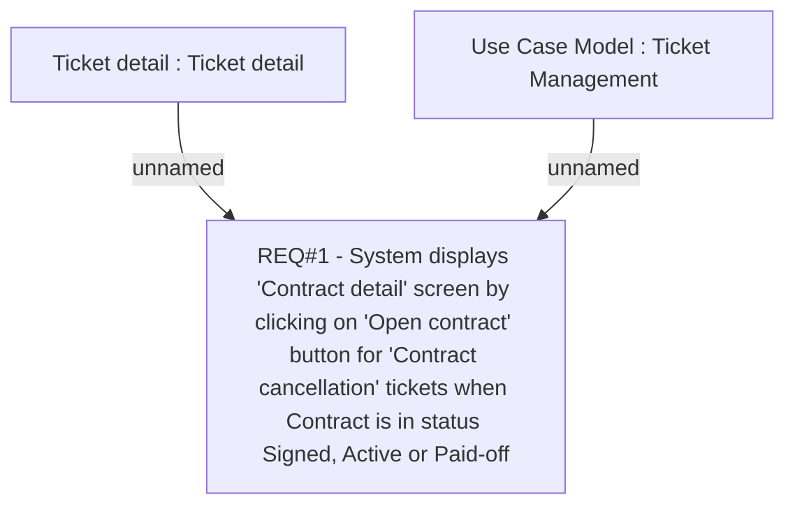

# CLM-737 (CBL-1180) Communication & Ticketing for Contract Cancellation

- **Diagram Type**: Custom
- **Package**: HomerSelect/BSL/Requirements Model/Finished/CLM/CLM-737 (CBL-1180) Communication & Ticketing for Contract Cancellation
- **Diagram ID**: 103414
- **Elements**: 3
- **Connectors**: 2

