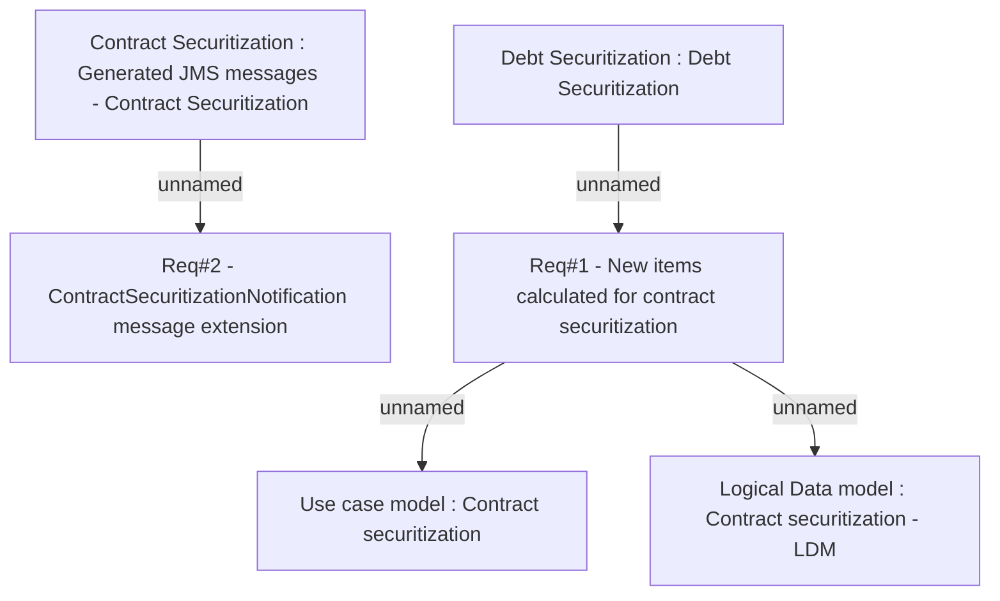

# CLM-746 (CBL-1050) Securitization - Insurance and fees

- **Diagram Type**: Custom
- **Package**: HomerSelect/BSL/Requirements Model/Finished/CLM/CLM-746 (CBL-1050) Securitization - Insurance and fees
- **Diagram ID**: 103350
- **Elements**: 6
- **Connectors**: 4

