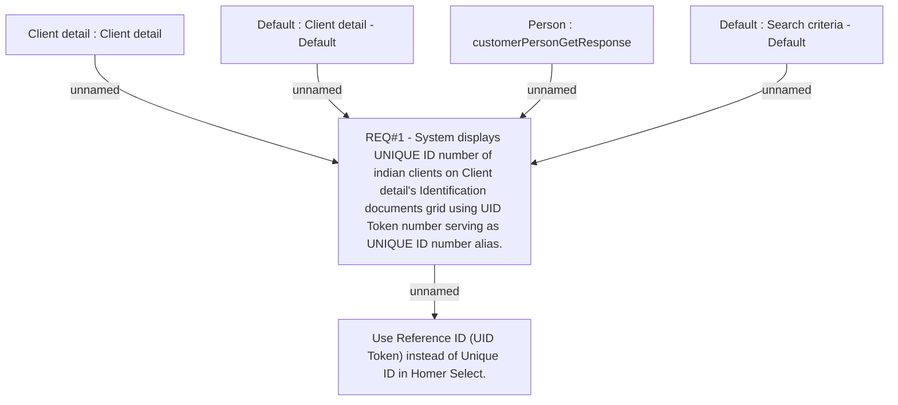

# CLM-747 (CBL-1126) Using Reference ID instead of Unique ID in HoSel

```mermaid
graph TD
    Default_Search_criteria_Default["Default : Search criteria - Default"]
    Person_customerPersonGetResponse["Person : customerPersonGetResponse"]
    Default_Client_detail_Default["Default : Client detail - Default"]
    Client_detail_Client_detail["Client detail : Client detail"]
    REQ_1_System_displays_UNIQUE_ID_number_of_indian_clients_on_["REQ#1 - System displays UNIQUE ID number of indian clients on Client detail's Identification documents grid using UID Token number serving as UNIQUE ID number alias."]
    Use_Reference_ID_UID_Token_instead_of_Unique_ID_in_Homer_Sel["Use Reference ID (UID Token) instead of Unique ID in Homer Select."]
    REQ_1_System_displays_UNIQUE_ID_number_of_indian_clients_on_ -->|unnamed| Use_Reference_ID_UID_Token_instead_of_Unique_ID_in_Homer_Sel
    Client_detail_Client_detail -->|unnamed| REQ_1_System_displays_UNIQUE_ID_number_of_indian_clients_on_
    Default_Client_detail_Default -->|unnamed| REQ_1_System_displays_UNIQUE_ID_number_of_indian_clients_on_
    Person_customerPersonGetResponse -->|unnamed| REQ_1_System_displays_UNIQUE_ID_number_of_indian_clients_on_
    Default_Search_criteria_Default -->|unnamed| REQ_1_System_displays_UNIQUE_ID_number_of_indian_clients_on_
```
