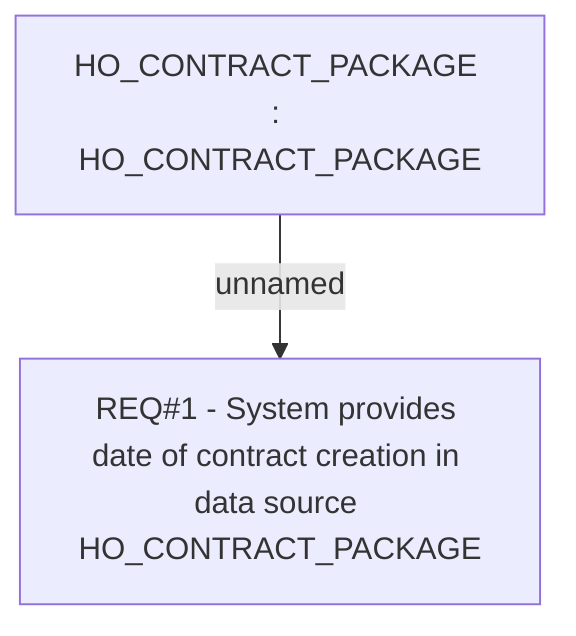

# CLM-753 (CBL-906) Add field to data source HO_CONTRACT_PACKAGE

- **Diagram Type**: Custom
- **Package**: HomerSelect/BSL/Requirements Model/Finished/CLM/CLM-753 (CBL-906) Add field to data source HO_CONTRACT_PACKAGE
- **Diagram ID**: 103405
- **Elements**: 2
- **Connectors**: 1

