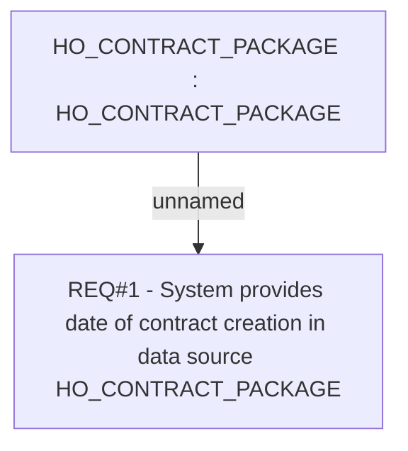

# CLM-753 (CBL-906) Add field to data source HO_CONTRACT_PACKAGE

```mermaid
graph TD
    HO_CONTRACT_PACKAGE_HO_CONTRACT_PACKAGE["HO_CONTRACT_PACKAGE : HO_CONTRACT_PACKAGE"]
    REQ_1_System_provides_date_of_contract_creation_in_data_sour["REQ#1 - System provides date of contract creation in data source HO_CONTRACT_PACKAGE"]
    HO_CONTRACT_PACKAGE_HO_CONTRACT_PACKAGE -->|unnamed| REQ_1_System_provides_date_of_contract_creation_in_data_sour
```
