# CLM-768 (CBL-1293) Replace CardManagementWS

- **Diagram Type**: Custom
- **Package**: HomerSelect/BSL/Requirements Model/Finished/CLM/CLM-768 (CBL-1293) Replace CardManagementWS
- **Diagram ID**: 103410
- **Elements**: 25
- **Connectors**: 22

```mermaid
graph TD
    n_12_505_Unblock_card["12.505 Unblock card"]
    n_12_504_Block_card["12.504 Block card"]
    n_12_509_Change_emboss_name["12.509 Change emboss name"]
    n_12_540_Card_blocking_overview["12.540 Card blocking overview"]
    n_12_542_Change_e_commerce_security_level["12.542 Change e-commerce security level"]
    n_12_536_Card_activation["12.536 Card activation"]
    n_12_503_Replace_card["12.503 Replace card"]
    n_12_501_Show_card_detail["12.501 Show card detail"]
    REQ_6_Goal_of_this_task_is_to_replace_obsolete_CardManagemet["REQ#6 - Goal of this task is to replace obsolete CardManagemetWS (provided by CMS) with new CardRetirementWS and endpoints in card management use cases supported by BSL - CLM. 
"]
    REQ_5_Goal_of_this_task_is_to_replace_obsolete_CardManagemet["REQ#5 - Goal of this task is to replace obsolete CardManagemetWS (provided by CMS) with new CardBlockWS and endpoints in card management use cases supported by BSL - CLM. 
"]
    REQ_3_Goal_of_this_task_is_to_replace_obsolete_CardManagemet["REQ#3 - Goal of this task is to replace obsolete CardManagemetWS (provided by CMS) with new CardTypeWS and endpoints in card management use cases supported by BSL - CLM. 
"]
    REQ_1_Goal_of_this_task_is_to_replace_obsolete_CardManagemet["REQ#1 - Goal of this task is to replace obsolete CardManagemetWS (provided by CMS) with new CardInfoWS and endpoints in card management use cases supported by BSL - CLM. 
"]
    diagram_EB110A22_4207_4fb1_8DAE_D4EBA9B2D8DA["$diagram://{EB110A22-4207-4fb1-8DAE-D4EBA9B2D8DA}"]
    diagram_FA195449_92A7_4588_A2EF_448E25E54ADB["$diagram://{FA195449-92A7-4588-A2EF-448E25E54ADB}"]
    diagram_A9DE3EF5_4AEC_46cd_984E_E3FA7E5A3224["$diagram://{A9DE3EF5-4AEC-46cd-984E-E3FA7E5A3224}"]
    diagram_2B7FB7F9_3D3E_48bf_8491_441A3C4C1BE5["$diagram://{2B7FB7F9-3D3E-48bf-8491-441A3C4C1BE5}"]
    diagram_9EEC2112_B220_4c16_9276_C75D5B391583["$diagram://{9EEC2112-B220-4c16-9276-C75D5B391583}"]
    diagram_49BBBA61_FDB6_4509_AD7D_0001333F3BF4["$diagram://{49BBBA61-FDB6-4509-AD7D-0001333F3BF4}"]
    diagram_E38C1C6B_D5B8_4410_BEFF_855BE4B8D0B0["$diagram://{E38C1C6B-D5B8-4410-BEFF-855BE4B8D0B0}"]
    diagram_9AF3B2D0_D51D_4740_8945_F3DE27CA9422["$diagram://{9AF3B2D0-D51D-4740-8945-F3DE27CA9422}"]
    diagram_F9A59099_560F_49ca_9BE6_487DF6F613EA["$diagram://{F9A59099-560F-49ca-9BE6-487DF6F613EA}"]
    diagram_B80483EB_82D8_4b4e_87EA_FAD4DC1E4851["$diagram://{B80483EB-82D8-4b4e-87EA-FAD4DC1E4851}"]
    REQ_4_Goal_of_this_task_is_to_replace_obsolete_CardManagemet["REQ#4 - Goal of this task is to replace obsolete CardManagemetWS (provided by CMS) with new CardModificationWS and endpoints in card management use cases supported by BSL - CLM. 
"]
    REQ_2_Goal_of_this_task_is_to_replace_obsolete_CardManagemet["REQ#2 - Goal of this task is to replace obsolete CardManagemetWS (provided by CMS) with new CardOriginationWS and endpoints in card management use cases supported by BSL - CLM. 
"]
    diagram_E1CE5B57_5E44_416c_B181_08D1F57D52B8["$diagram://{E1CE5B57-5E44-416c-B181-08D1F57D52B8}"]
    diagram_9EEC2112_B220_4c16_9276_C75D5B391583 -->|unnamed| n_12_504_Block_card
    REQ_6_Goal_of_this_task_is_to_replace_obsolete_CardManagemet -->|unnamed| diagram_2B7FB7F9_3D3E_48bf_8491_441A3C4C1BE5
    REQ_5_Goal_of_this_task_is_to_replace_obsolete_CardManagemet -->|unnamed| diagram_9EEC2112_B220_4c16_9276_C75D5B391583
    REQ_5_Goal_of_this_task_is_to_replace_obsolete_CardManagemet -->|unnamed| diagram_A9DE3EF5_4AEC_46cd_984E_E3FA7E5A3224
    REQ_5_Goal_of_this_task_is_to_replace_obsolete_CardManagemet -->|unnamed| diagram_E38C1C6B_D5B8_4410_BEFF_855BE4B8D0B0
    REQ_3_Goal_of_this_task_is_to_replace_obsolete_CardManagemet -->|unnamed| diagram_F9A59099_560F_49ca_9BE6_487DF6F613EA
    REQ_1_Goal_of_this_task_is_to_replace_obsolete_CardManagemet -->|unnamed| diagram_E1CE5B57_5E44_416c_B181_08D1F57D52B8
    diagram_EB110A22_4207_4fb1_8DAE_D4EBA9B2D8DA -->|unnamed| n_12_536_Card_activation
    diagram_FA195449_92A7_4588_A2EF_448E25E54ADB -->|unnamed| n_12_509_Change_emboss_name
    REQ_6_Goal_of_this_task_is_to_replace_obsolete_CardManagemet -->|unnamed| diagram_49BBBA61_FDB6_4509_AD7D_0001333F3BF4
    diagram_2B7FB7F9_3D3E_48bf_8491_441A3C4C1BE5 -->|unnamed| n_12_504_Block_card
    diagram_E1CE5B57_5E44_416c_B181_08D1F57D52B8 -->|unnamed| n_12_501_Show_card_detail
    diagram_49BBBA61_FDB6_4509_AD7D_0001333F3BF4 -->|unnamed| n_12_504_Block_card
    diagram_E38C1C6B_D5B8_4410_BEFF_855BE4B8D0B0 -->|unnamed| n_12_540_Card_blocking_overview
    diagram_9AF3B2D0_D51D_4740_8945_F3DE27CA9422 -->|unnamed| n_12_542_Change_e_commerce_security_level
    diagram_F9A59099_560F_49ca_9BE6_487DF6F613EA -->|unnamed| n_12_542_Change_e_commerce_security_level
    diagram_B80483EB_82D8_4b4e_87EA_FAD4DC1E4851 -->|unnamed| n_12_503_Replace_card
    REQ_4_Goal_of_this_task_is_to_replace_obsolete_CardManagemet -->|unnamed| diagram_FA195449_92A7_4588_A2EF_448E25E54ADB
    REQ_4_Goal_of_this_task_is_to_replace_obsolete_CardManagemet -->|unnamed| diagram_9AF3B2D0_D51D_4740_8945_F3DE27CA9422
    REQ_2_Goal_of_this_task_is_to_replace_obsolete_CardManagemet -->|unnamed| diagram_EB110A22_4207_4fb1_8DAE_D4EBA9B2D8DA
    REQ_2_Goal_of_this_task_is_to_replace_obsolete_CardManagemet -->|unnamed| diagram_B80483EB_82D8_4b4e_87EA_FAD4DC1E4851
    diagram_A9DE3EF5_4AEC_46cd_984E_E3FA7E5A3224 -->|unnamed| n_12_505_Unblock_card
```

