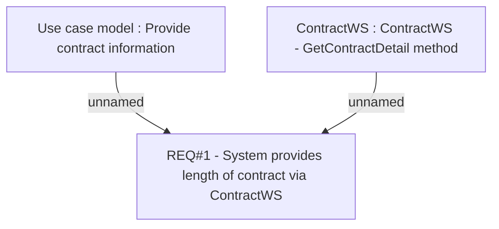

# CLM-769 (CBL-1041) Extension of COntractWS API - Tenor

```mermaid
graph TD
    ContractWS_ContractWS_GetContractDetail_method["ContractWS : ContractWS - GetContractDetail method"]
    Use_case_model_Provide_contract_information["Use case model : Provide contract information"]
    REQ_1_System_provides_length_of_contract_via_ContractWS["REQ#1 - System provides length of contract via ContractWS"]
    Use_case_model_Provide_contract_information -->|unnamed| REQ_1_System_provides_length_of_contract_via_ContractWS
    ContractWS_ContractWS_GetContractDetail_method -->|unnamed| REQ_1_System_provides_length_of_contract_via_ContractWS
```
