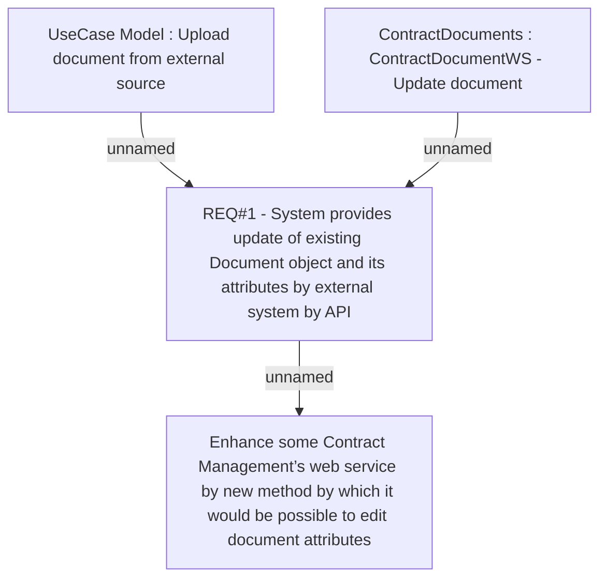

# CLM-776 (CBL-1324) Paperlerss REQ14 - Edit documents

- **Diagram Type**: Custom
- **Package**: HomerSelect/BSL/Requirements Model/Finished/CLM/CLM-776 (CBL-1324) Paperlerss REQ14 - Edit documents
- **Diagram ID**: 103422
- **Elements**: 4
- **Connectors**: 3

