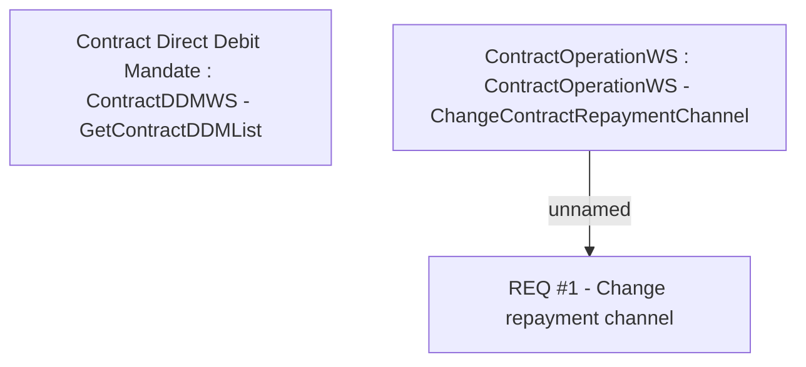

# CLM-781 (CBL-1140) IN Paperless REQ8 - Setting of repayment channel

- **Diagram Type**: Custom
- **Package**: HomerSelect/BSL/Requirements Model/Finished/CLM/CLM-781 (CBL-1140) IN Paperless REQ8 - Setting of repayment channel
- **Diagram ID**: 103390
- **Elements**: 3
- **Connectors**: 1

