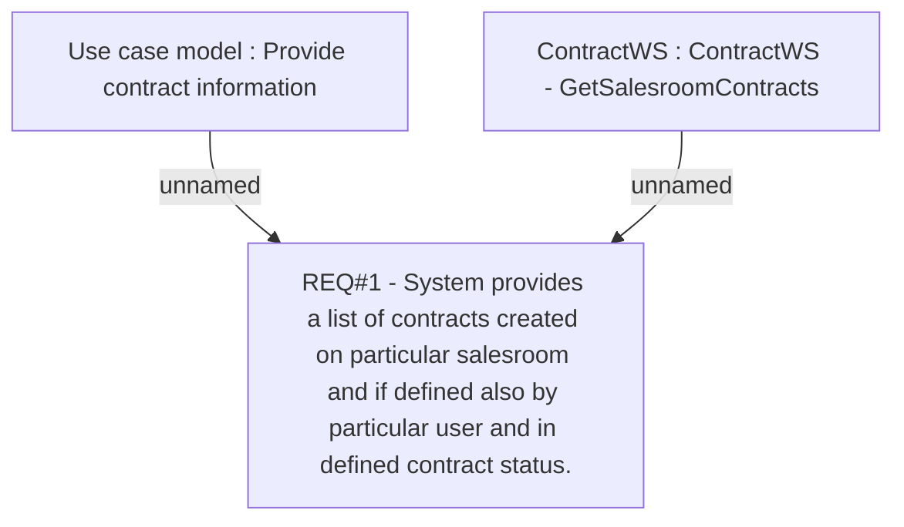

# CLM-788 (CBL-1137) Publish list of contracts created on salesroom

```mermaid
graph TD
    ContractWS_ContractWS_GetSalesroomContracts["ContractWS : ContractWS - GetSalesroomContracts"]
    Use_case_model_Provide_contract_information["Use case model : Provide contract information"]
    REQ_1_System_provides_a_list_of_contracts_created_on_particu["REQ#1 - System provides a list of contracts created on particular salesroom and if defined also by particular user and in defined contract status."]
    Use_case_model_Provide_contract_information -->|unnamed| REQ_1_System_provides_a_list_of_contracts_created_on_particu
    ContractWS_ContractWS_GetSalesroomContracts -->|unnamed| REQ_1_System_provides_a_list_of_contracts_created_on_particu
```
