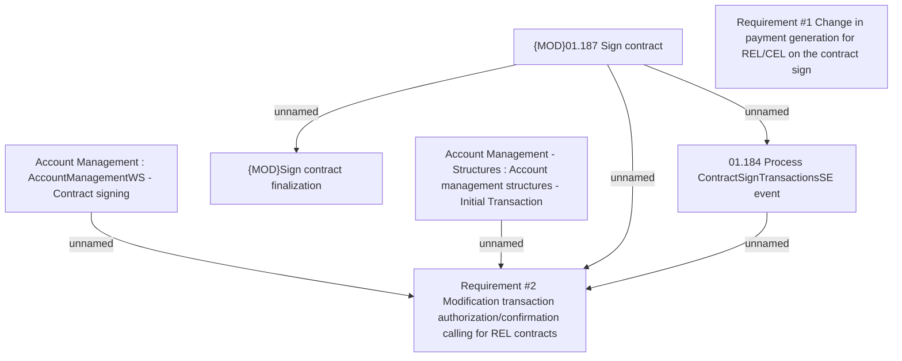

# CLM-819 (CBL-860) Unification reimbursement from credit cards

- **Diagram Type**: Custom
- **Package**: HomerSelect/BSL/Requirements Model/Finished/CLM/CLM-819 (CBL-860) Unification reimbursement from credit cards
- **Diagram ID**: 103392
- **Elements**: 7
- **Connectors**: 6

