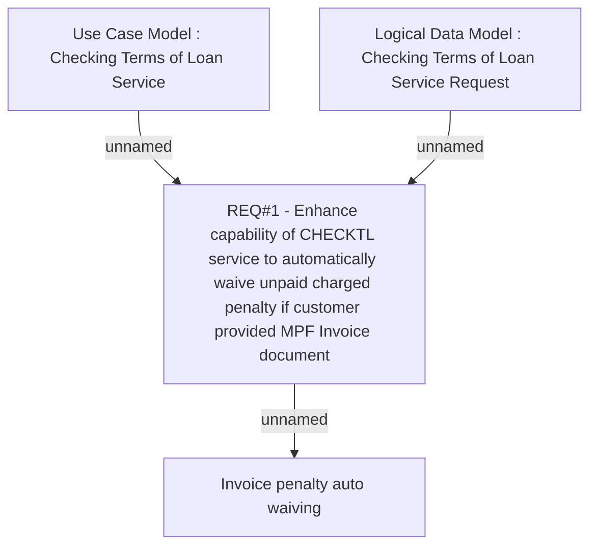

# CLM-830 (CBL-1519) MPF Invoice Penalty Auto Waiving

```mermaid
graph TD
    Logical_Data_Model_Checking_Terms_of_Loan_Service_Request["Logical Data Model : Checking Terms of Loan Service Request"]
    Use_Case_Model_Checking_Terms_of_Loan_Service["Use Case Model : Checking Terms of Loan Service"]
    REQ_1_Enhance_capability_of_CHECKTL_service_to_automatically["REQ#1 - Enhance capability of CHECKTL service to automatically waive unpaid charged penalty if customer provided MPF Invoice document"]
    Invoice_penalty_auto_waiving["Invoice penalty auto waiving"]
    REQ_1_Enhance_capability_of_CHECKTL_service_to_automatically -->|unnamed| Invoice_penalty_auto_waiving
    Use_Case_Model_Checking_Terms_of_Loan_Service -->|unnamed| REQ_1_Enhance_capability_of_CHECKTL_service_to_automatically
    Logical_Data_Model_Checking_Terms_of_Loan_Service_Request -->|unnamed| REQ_1_Enhance_capability_of_CHECKTL_service_to_automatically
```
