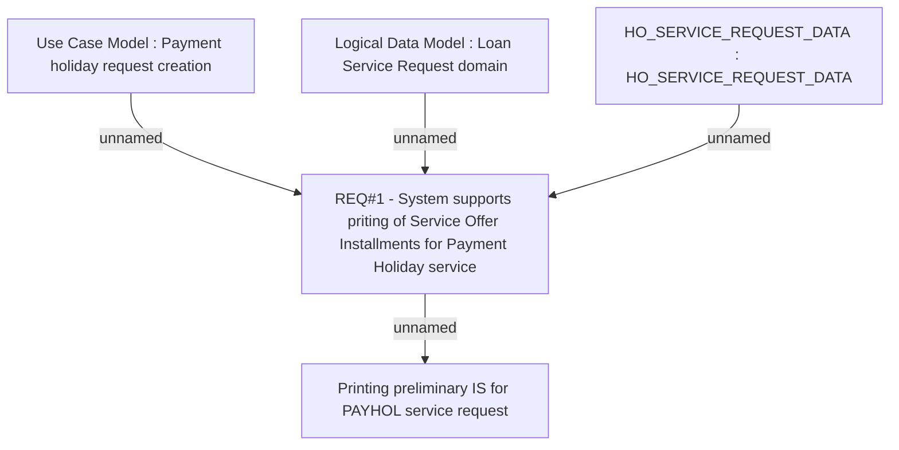

# CLM-847 (CBL-1619) Printing preliminary IS for PAYHOL service request

- **Diagram Type**: Custom
- **Package**: HomerSelect/BSL/Requirements Model/Finished/CLM/CLM-847 (CBL-1619) Printing preliminary IS for PAYHOL service request
- **Diagram ID**: 103468
- **Elements**: 5
- **Connectors**: 4

