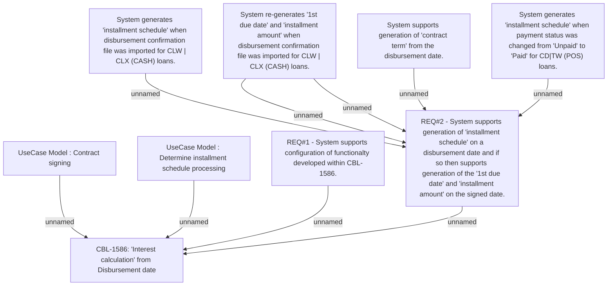

# CLM-864 (CBL-1586) Interest calculation from Disbursement date

- **Diagram Type**: Custom
- **Package**: HomerSelect/BSL/Requirements Model/Finished/CLM/CLM-864 (CBL-1586) Interest calculation from Disbursement date
- **Diagram ID**: 103449
- **Elements**: 10
- **Connectors**: 9

