# CLM-865 (CBL-1142) IN Paperless REQ10 - Contract registration process

- **Diagram Type**: Custom
- **Package**: HomerSelect/BSL/Requirements Model/Finished/CLM/CLM-865 (CBL-1142) IN Paperless REQ10 - Contract registration process
- **Diagram ID**: 103426
- **Elements**: 15
- **Connectors**: 21

```mermaid
graph TD
    Access_Rights_Access_Rights["Access Rights : Access Rights"]
    REQ_9_System_distingushes_between_contracts_in_Registration_["REQ#9 - System distingushes between contracts in 'Registration queue' based on business category"]
    User_Interface_Model_Registration_queue_screen["User Interface Model : Registration queue screen"]
    Logical_data_model_Registration_queue_domain["Logical data model : Registration queue domain"]
    UseCase_Model_Registration_queue_management["UseCase Model : Registration queue management"]
    el_1272113["Note"]
    REQ_8_System_enables_Registration_supervisors_to_assign_cont["REQ#8 - System enables 'Registration supervisors' to assign contracts to 'Registration operators' according to opened registration mistake."]
    REQ_7_System_enables_Registration_supervisors_to_assign_cont["REQ#7 - System enables 'Registration supervisors' to assign contracts to 'Registration operators' according to business category."]
    REQ_6_System_displays_how_many_contracts_are_to_be_registere["REQ#6 - System displays how many contracts are to be registered (left in 'Registration queue') based on business category."]
    REQ_5_System_automatically_assigns_contract_in_Registration_["REQ#5 - System automatically assigns contract in 'Registration queue' to eligible 'Registration operator' according to business category."]
    REQ_4_System_displays_contracts_in_Registration_queue_assign["REQ#4 - System displays contracts in 'Registration queue' assigned to user - 'Registration operator'."]
    REQ_3_System_supports_assignment_of_unregistered_contracts_t["REQ#3 - System supports assignment of unregistered contracts to registration operators according to opened registration mistake."]
    REQ_2_System_fills_Registration_queue_only_with_contracts_wi["REQ#2 - System fills 'Registration queue' only with contracts with status 'Signed' or 'Approved' or 'In pre-process' or 'In-process' (pre-registration statuses)."]
    REQ_1_System_orders_contracts_in_Registration_queue_by_the_c["REQ#1 - System orders contracts in 'Registration queue' by the contract signature date ascendant (FIFO - first in first out = first signed first registered)."]
    Modify_the_current_Registration_queue_to_usage_by_IN_busines["Modify the current Registration queue to usage by IN business as follow:

- definition of business rules for assignment of contracts to operators
- supervisor will have the registration queue overview categorized by above mentioned rules"]
    el_1272113 -->|unnamed| REQ_3_System_supports_assignment_of_unregistered_contracts_t
    REQ_9_System_distingushes_between_contracts_in_Registration_ -->|unnamed| Modify_the_current_Registration_queue_to_usage_by_IN_busines
    User_Interface_Model_Registration_queue_screen -->|unnamed| REQ_6_System_displays_how_many_contracts_are_to_be_registere
    User_Interface_Model_Registration_queue_screen -->|unnamed| REQ_7_System_enables_Registration_supervisors_to_assign_cont
    Logical_data_model_Registration_queue_domain -->|unnamed| REQ_9_System_distingushes_between_contracts_in_Registration_
    UseCase_Model_Registration_queue_management -->|unnamed| REQ_5_System_automatically_assigns_contract_in_Registration_
    UseCase_Model_Registration_queue_management -->|unnamed| REQ_6_System_displays_how_many_contracts_are_to_be_registere
    UseCase_Model_Registration_queue_management -->|unnamed| REQ_7_System_enables_Registration_supervisors_to_assign_cont
    el_1272113 -->|unnamed| REQ_4_System_displays_contracts_in_Registration_queue_assign
    Access_Rights_Access_Rights -->|unnamed| REQ_5_System_automatically_assigns_contract_in_Registration_
    el_1272113 -->|unnamed| REQ_8_System_enables_Registration_supervisors_to_assign_cont
    REQ_1_System_orders_contracts_in_Registration_queue_by_the_c -->|unnamed| Modify_the_current_Registration_queue_to_usage_by_IN_busines
    el_1272113 -->|unnamed| REQ_2_System_fills_Registration_queue_only_with_contracts_wi
    REQ_8_System_enables_Registration_supervisors_to_assign_cont -->|unnamed| Modify_the_current_Registration_queue_to_usage_by_IN_busines
    REQ_7_System_enables_Registration_supervisors_to_assign_cont -->|unnamed| Modify_the_current_Registration_queue_to_usage_by_IN_busines
    REQ_6_System_displays_how_many_contracts_are_to_be_registere -->|unnamed| Modify_the_current_Registration_queue_to_usage_by_IN_busines
    REQ_5_System_automatically_assigns_contract_in_Registration_ -->|unnamed| Modify_the_current_Registration_queue_to_usage_by_IN_busines
    REQ_4_System_displays_contracts_in_Registration_queue_assign -->|unnamed| Modify_the_current_Registration_queue_to_usage_by_IN_busines
    REQ_3_System_supports_assignment_of_unregistered_contracts_t -->|unnamed| Modify_the_current_Registration_queue_to_usage_by_IN_busines
    REQ_2_System_fills_Registration_queue_only_with_contracts_wi -->|unnamed| Modify_the_current_Registration_queue_to_usage_by_IN_busines
    el_1272113 -->|unnamed| REQ_1_System_orders_contracts_in_Registration_queue_by_the_c
```

