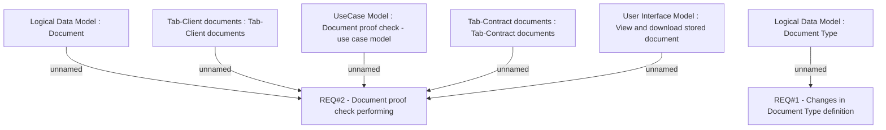

# CLM-89 (CBL-57) CKYC support

- **Diagram Type**: Custom
- **Package**: HomerSelect/BSL/Requirements Model/Finished/CLM/CLM-89 (CBL-57) CKYC support
- **Diagram ID**: 103167
- **Elements**: 8
- **Connectors**: 6

