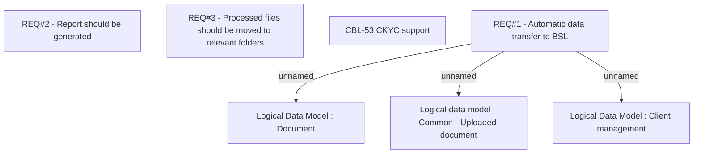

# CLM-90 (CBL-53) CKYC support

```mermaid
graph TD
    Logical_Data_Model_Document["Logical Data Model : Document "]
    Logical_data_model_Common_Uploaded_document["Logical data model : Common - Uploaded document"]
    Logical_Data_Model_Client_management["Logical Data Model : Client management"]
    REQ_2_Report_should_be_generated["REQ#2 - Report should be generated"]
    REQ_3_Processed_files_should_be_moved_to_relevant_folders["REQ#3 - Processed files should be moved to relevant folders"]
    CBL_53_CKYC_support["CBL-53 CKYC support"]
    REQ_1_Automatic_data_transfer_to_BSL["REQ#1 - Automatic data transfer to BSL"]
    REQ_1_Automatic_data_transfer_to_BSL -->|unnamed| Logical_Data_Model_Document
    REQ_1_Automatic_data_transfer_to_BSL -->|unnamed| Logical_data_model_Common_Uploaded_document
    REQ_1_Automatic_data_transfer_to_BSL -->|unnamed| Logical_Data_Model_Client_management
```
