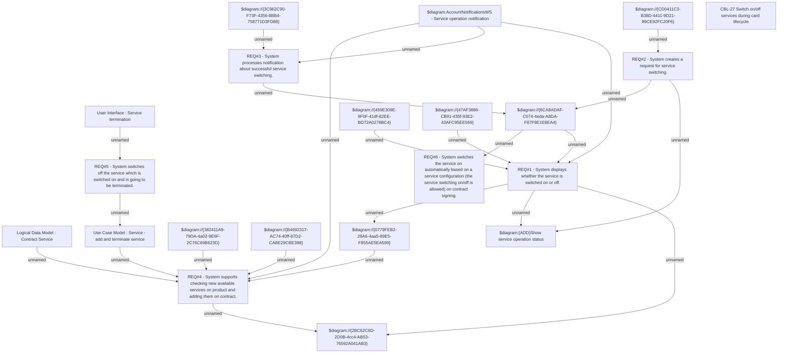

# CLM-91 (CBL-27) Switch on/off services during card lifecycle

```mermaid
graph TD
    Logical_Data_Model_Contract_Service["Logical Data Model : Contract Service"]
    User_Interface_Service_termination["User Interface : Service termination"]
    Use_Case_Model_Service_add_and_terminate_service["Use Case Model : Service - add and terminate service"]
    diagram_6CA8ADAF_C074_4eda_A8DA_F87F9E1E8EA4["$diagram://{6CA8ADAF-C074-4eda-A8DA-F87F9E1E8EA4}"]
    diagram_CD0411C3_B38D_4411_9D21_89CE92FC20F6["$diagram://{CD0411C3-B38D-4411-9D21-89CE92FC20F6}"]
    REQ_6_System_switches_the_service_on_automatically_based_on_["REQ#6 - System switches the service on automatically based on a service configuration (the service switching on/off is allowed) on contract signing."]
    diagram_AccountNotificationsWS_Service_operation_notificatio["$diagram:AccountNotificationsWS - Service operation notification"]
    REQ_5_System_switches_off_the_service_which_is_switched_on_a["REQ#5 - System switches off the service which is switched on and is going to be terminated."]
    diagram_382411A9_79DA_4a02_9E6F_2C76C69B623D["$diagram://{382411A9-79DA-4a02-9E6F-2C76C69B623D}"]
    diagram_3C962C90_F73F_4356_8BB4_758771D3FD88["$diagram://{3C962C90-F73F-4356-8BB4-758771D3FD88}"]
    diagram_B4692317_AC74_40ff_87D2_CABE29CBE398["$diagram://{B4692317-AC74-40ff-87D2-CABE29CBE398}"]
    REQ_4_System_supports_checking_new_available_services_on_pro["REQ#4 - System supports checking new available services on product and adding them on contract."]
    diagram_459E309E_9F0F_41df_82EE_BD72A0278BC4["$diagram://{459E309E-9F0F-41df-82EE-BD72A0278BC4}"]
    diagram_47AF3886_CB91_435f_93E2_43AFC95EE569["$diagram://{47AF3886-CB91-435f-93E2-43AFC95EE569}"]
    diagram_2BC62C6D_2D0B_4cc4_AB53_76592A041AB3["$diagram://{2BC62C6D-2D0B-4cc4-AB53-76592A041AB3}"]
    diagram_0779FEB2_28A6_4aa5_89E5_F855AE5EA599["$diagram://{0779FEB2-28A6-4aa5-89E5-F855AE5EA599}"]
    diagram_ADD_Show_service_operation_status["$diagram:{ADD}Show service operation status"]
    REQ_3_System_processes_notification_about_successful_service["REQ#3 - System processes notification about successful service switching."]
    REQ_2_System_creates_a_request_for_service_switching["REQ#2 - System creates a request for service switching."]
    CBL_27_Switch_on_off_services_during_card_lifecycle["CBL-27 Switch on/off services during card lifecycle"]
    REQ_1_System_displays_whether_the_service_is_switched_on_or_["REQ#1 - System displays whether the service is switched on or off."]
    REQ_3_System_processes_notification_about_successful_service -->|unnamed| diagram_6CA8ADAF_C074_4eda_A8DA_F87F9E1E8EA4
    REQ_2_System_creates_a_request_for_service_switching -->|unnamed| diagram_6CA8ADAF_C074_4eda_A8DA_F87F9E1E8EA4
    REQ_2_System_creates_a_request_for_service_switching -->|unnamed| diagram_ADD_Show_service_operation_status
    REQ_1_System_displays_whether_the_service_is_switched_on_or_ -->|unnamed| diagram_0779FEB2_28A6_4aa5_89E5_F855AE5EA599
    REQ_1_System_displays_whether_the_service_is_switched_on_or_ -->|unnamed| diagram_ADD_Show_service_operation_status
    diagram_382411A9_79DA_4a02_9E6F_2C76C69B623D -->|unnamed| REQ_4_System_supports_checking_new_available_services_on_pro
    diagram_B4692317_AC74_40ff_87D2_CABE29CBE398 -->|unnamed| REQ_4_System_supports_checking_new_available_services_on_pro
    User_Interface_Service_termination -->|unnamed| REQ_5_System_switches_off_the_service_which_is_switched_on_a
    Use_Case_Model_Service_add_and_terminate_service -->|unnamed| REQ_4_System_supports_checking_new_available_services_on_pro
    diagram_6CA8ADAF_C074_4eda_A8DA_F87F9E1E8EA4 -->|unnamed| REQ_6_System_switches_the_service_on_automatically_based_on_
    diagram_6CA8ADAF_C074_4eda_A8DA_F87F9E1E8EA4 -->|unnamed| REQ_1_System_displays_whether_the_service_is_switched_on_or_
    diagram_CD0411C3_B38D_4411_9D21_89CE92FC20F6 -->|unnamed| REQ_2_System_creates_a_request_for_service_switching
    diagram_AccountNotificationsWS_Service_operation_notificatio -->|unnamed| REQ_4_System_supports_checking_new_available_services_on_pro
    diagram_AccountNotificationsWS_Service_operation_notificatio -->|unnamed| REQ_3_System_processes_notification_about_successful_service
    diagram_AccountNotificationsWS_Service_operation_notificatio -->|unnamed| REQ_1_System_displays_whether_the_service_is_switched_on_or_
    REQ_5_System_switches_off_the_service_which_is_switched_on_a -->|unnamed| Use_Case_Model_Service_add_and_terminate_service
    Logical_Data_Model_Contract_Service -->|unnamed| REQ_4_System_supports_checking_new_available_services_on_pro
    diagram_3C962C90_F73F_4356_8BB4_758771D3FD88 -->|unnamed| REQ_3_System_processes_notification_about_successful_service
    REQ_1_System_displays_whether_the_service_is_switched_on_or_ -->|unnamed| diagram_2BC62C6D_2D0B_4cc4_AB53_76592A041AB3
    REQ_4_System_supports_checking_new_available_services_on_pro -->|unnamed| diagram_2BC62C6D_2D0B_4cc4_AB53_76592A041AB3
    diagram_459E309E_9F0F_41df_82EE_BD72A0278BC4 -->|unnamed| REQ_1_System_displays_whether_the_service_is_switched_on_or_
    diagram_47AF3886_CB91_435f_93E2_43AFC95EE569 -->|unnamed| REQ_1_System_displays_whether_the_service_is_switched_on_or_
    diagram_0779FEB2_28A6_4aa5_89E5_F855AE5EA599 -->|unnamed| REQ_4_System_supports_checking_new_available_services_on_pro
```
