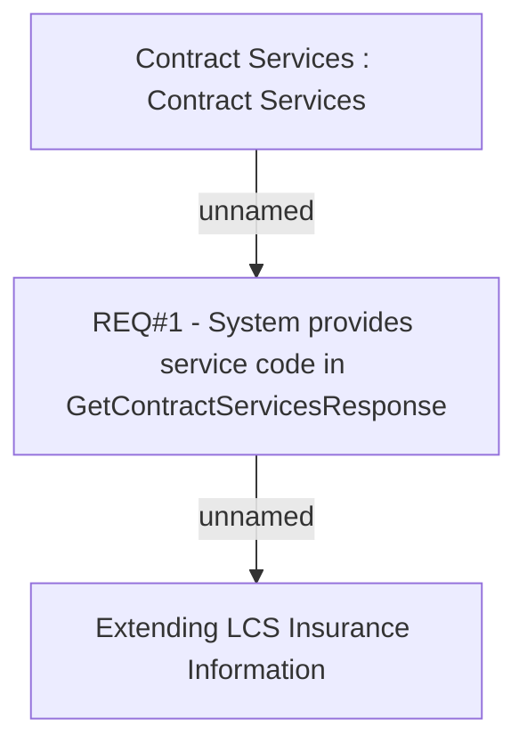

# CLM-913 (CBL-1518) Extending LCS Insurance Information - Phase 2

```mermaid
graph TD
    Extending_LCS_Insurance_Information["Extending LCS Insurance Information"]
    Contract_Services_Contract_Services["Contract Services : Contract Services"]
    REQ_1_System_provides_service_code_in_GetContractServicesRes["REQ#1 - System provides service code in GetContractServicesResponse "]
    REQ_1_System_provides_service_code_in_GetContractServicesRes -->|unnamed| Extending_LCS_Insurance_Information
    Contract_Services_Contract_Services -->|unnamed| REQ_1_System_provides_service_code_in_GetContractServicesRes
```
