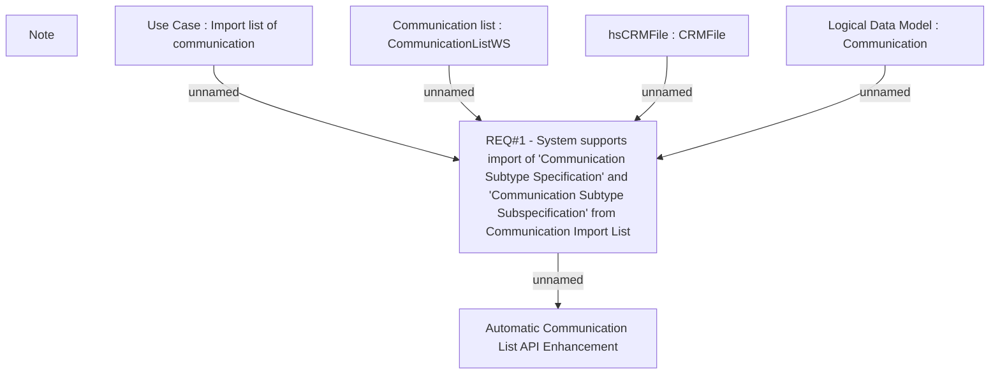

# CLM-915 (CBL-1764) Automatic Communication List API Enhancement

```mermaid
graph TD
    el_1272403["Note"]
    Logical_Data_Model_Communication["Logical Data Model : Communication"]
    hsCRMFile_CRMFile["hsCRMFile : CRMFile"]
    Communication_list_CommunicationListWS["Communication list : CommunicationListWS"]
    Use_Case_Import_list_of_communication["Use Case : Import list of communication"]
    REQ_1_System_supports_import_of_Communication_Subtype_Specif["REQ#1 - System supports import of 'Communication Subtype Specification' and 'Communication Subtype Subspecification' from Communication Import List"]
    Automatic_Communication_List_API_Enhancement["Automatic Communication List API Enhancement"]
    REQ_1_System_supports_import_of_Communication_Subtype_Specif -->|unnamed| Automatic_Communication_List_API_Enhancement
    Use_Case_Import_list_of_communication -->|unnamed| REQ_1_System_supports_import_of_Communication_Subtype_Specif
    Communication_list_CommunicationListWS -->|unnamed| REQ_1_System_supports_import_of_Communication_Subtype_Specif
    hsCRMFile_CRMFile -->|unnamed| REQ_1_System_supports_import_of_Communication_Subtype_Specif
    Logical_Data_Model_Communication -->|unnamed| REQ_1_System_supports_import_of_Communication_Subtype_Specif
```
