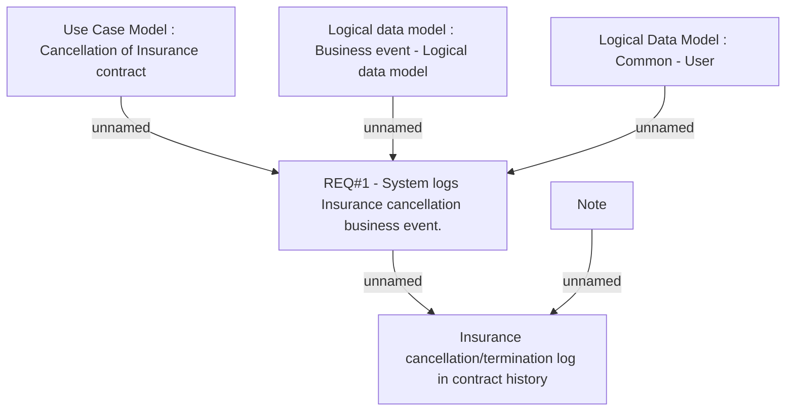

# CLM-925 (CBL-1786) Insurance cancellation/termination log in contract history

```mermaid
graph TD
    Logical_Data_Model_Common_User["Logical Data Model : Common - User"]
    Logical_data_model_Business_event_Logical_data_model["Logical data model : Business event - Logical data model"]
    Use_Case_Model_Cancellation_of_Insurance_contract["Use Case Model : Cancellation of Insurance contract"]
    el_1272279["Note"]
    REQ_1_System_logs_Insurance_cancellation_business_event["REQ#1 - System logs Insurance cancellation business event."]
    Insurance_cancellation_termination_log_in_contract_history["Insurance cancellation/termination log in contract history"]
    REQ_1_System_logs_Insurance_cancellation_business_event -->|unnamed| Insurance_cancellation_termination_log_in_contract_history
    el_1272279 -->|unnamed| Insurance_cancellation_termination_log_in_contract_history
    Use_Case_Model_Cancellation_of_Insurance_contract -->|unnamed| REQ_1_System_logs_Insurance_cancellation_business_event
    Logical_data_model_Business_event_Logical_data_model -->|unnamed| REQ_1_System_logs_Insurance_cancellation_business_event
    Logical_Data_Model_Common_User -->|unnamed| REQ_1_System_logs_Insurance_cancellation_business_event
```
