# CLM-93 (CBL-29) Consolidation (Top-up) for cash loans

- **Diagram Type**: Custom
- **Package**: HomerSelect/BSL/Requirements Model/Finished/CLM/CLM-93 (CBL-29) Consolidation (Top-up) for cash loans
- **Diagram ID**: 84604
- **Elements**: 21
- **Connectors**: 15

```mermaid
graph TD
    Compute_cash_loan_disbursement_amount["Compute cash loan disbursement amount"]
    UseCase_Model_Cancel_contract_manually_Use_case_diagram["UseCase Model : Cancel contract manually - Use case diagram"]
    Requirement_6_Cancellation_consolidation_contract["Requirement #6 - Cancellation consolidation contract"]
    REQ_4_Finalize_consolidation["REQ#4 - Finalize consolidation"]
    Use_Case_Model_Loan_consolidation_use_case_model["Use Case Model : Loan consolidation - use case model"]
    Logical_Data_Model_Contract_Early_Termination_Variant["Logical Data Model : Contract Early Termination Variant"]
    DirectDebitService_DirectDebitService["DirectDebitService : DirectDebitService"]
    REQ_1_Changes_in_contract_signature_functionality["REQ#1 - Changes in contract signature functionality"]
    Business_rules_System_events_processing_setting["Business rules : System events processing setting"]
    REQ_1_1_Repayment_cash_for_consolidation["REQ#1.1 - Repayment cash for consolidation"]
    Use_Case_Model_Generate_and_Cancel_outgoing_payments["Use Case Model : Generate and Cancel outgoing payments"]
    CreatePayment_PaymentsWS_CreatePayment["CreatePayment : PaymentsWS.CreatePayment"]
    UseCase_Model_Contract_signing["UseCase Model : Contract signing"]
    Use_Case_Model_Processing_disbursement_confirmation_message["Use Case Model : Processing disbursement confirmation message"]
    BRR_2235_Refinance_and_Consolidation_Refinanced_Contract_Log["BRR-2235 Refinance and Consolidation : Refinanced Contract - Logical data model"]
    REQ_2_1_Eligibility_of_the_contract_to_consolidation["REQ#2.1 - Eligibility of the contract to consolidation"]
    REQ_3_New_functionality_for_consolidation_perfoming["REQ#3 - New functionality for consolidation perfoming"]
    REQ_2_New_functionality_for_preparation_of_consolidation["REQ#2 - New functionality for preparation of consolidation"]
    Consolidation_clarification_of_CBL_29_vs_new_requirement_CBL["Consolidation - clarification of CBL-29 vs new requirement CBL-160 (2.6.2017)"]
    CBL_29_Consolidation_Top_up_for_cash_loans["CBL-29 Consolidation (Top-up) for cash loans"]
    CLM_93["CLM-93"]
    UseCase_Model_Cancel_contract_manually_Use_case_diagram -->|unnamed| Requirement_6_Cancellation_consolidation_contract
    REQ_2_New_functionality_for_preparation_of_consolidation -->|unnamed| Logical_Data_Model_Contract_Early_Termination_Variant
    BRR_2235_Refinance_and_Consolidation_Refinanced_Contract_Log -->|unnamed| REQ_2_New_functionality_for_preparation_of_consolidation
    BRR_2235_Refinance_and_Consolidation_Refinanced_Contract_Log -->|unnamed| REQ_1_1_Repayment_cash_for_consolidation
    Use_Case_Model_Processing_disbursement_confirmation_message -->|unnamed| REQ_3_New_functionality_for_consolidation_perfoming
    UseCase_Model_Contract_signing -->|unnamed| REQ_1_Changes_in_contract_signature_functionality
    CreatePayment_PaymentsWS_CreatePayment -->|unnamed| REQ_3_New_functionality_for_consolidation_perfoming
    Use_Case_Model_Generate_and_Cancel_outgoing_payments -->|unnamed| REQ_1_1_Repayment_cash_for_consolidation
    REQ_1_1_Repayment_cash_for_consolidation -->|unnamed| REQ_1_Changes_in_contract_signature_functionality
    Business_rules_System_events_processing_setting -->|unnamed| REQ_1_Changes_in_contract_signature_functionality
    Business_rules_System_events_processing_setting -->|unnamed| REQ_2_New_functionality_for_preparation_of_consolidation
    DirectDebitService_DirectDebitService -->|unnamed| REQ_2_New_functionality_for_preparation_of_consolidation
    Use_Case_Model_Loan_consolidation_use_case_model -->|unnamed| REQ_2_New_functionality_for_preparation_of_consolidation
    Use_Case_Model_Loan_consolidation_use_case_model -->|unnamed| REQ_3_New_functionality_for_consolidation_perfoming
    Use_Case_Model_Loan_consolidation_use_case_model -->|unnamed| REQ_4_Finalize_consolidation
```

