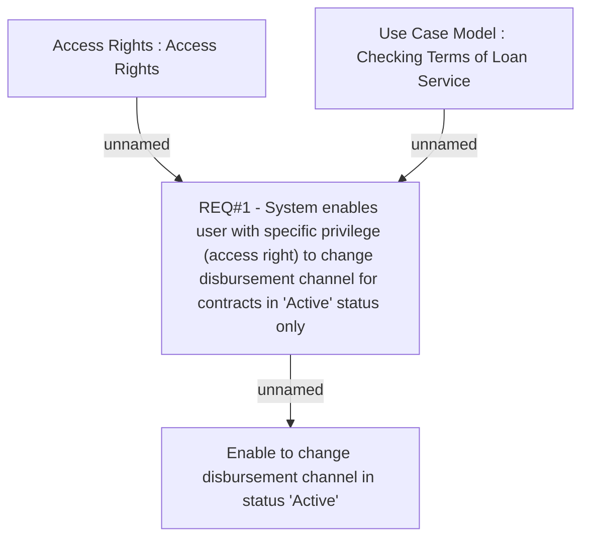

# CLM-937 (CBL-1864) Enable to Change Disbursement Channel in Status Active

- **Diagram Type**: Custom
- **Package**: HomerSelect/BSL/Requirements Model/Finished/CLM/CLM-937 (CBL-1864) Enable to Change Disbursement Channel in Status Active
- **Diagram ID**: 103469
- **Elements**: 4
- **Connectors**: 3

