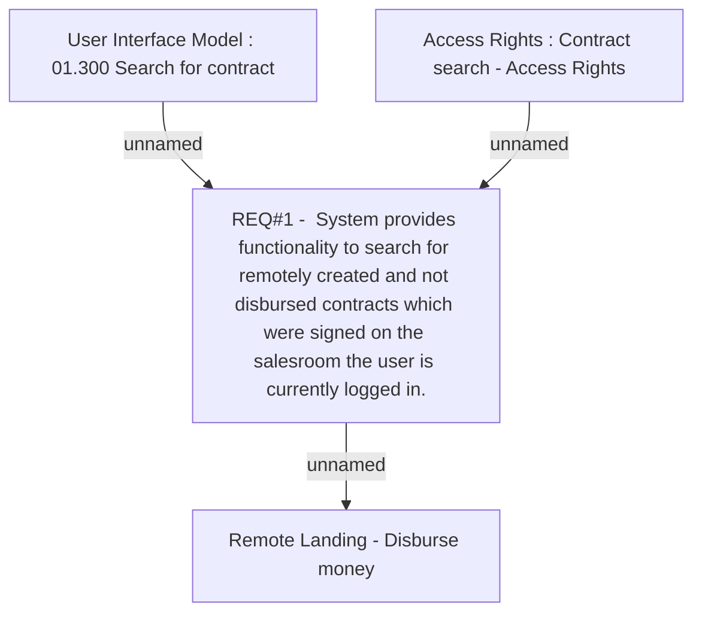

# CLM-939 (CBL-1863) Remote Landing - Disburse money (Kazpost channel)

```mermaid
graph TD
    Access_Rights_Contract_search_Access_Rights["Access Rights : Contract search - Access Rights"]
    User_Interface_Model_01_300_Search_for_contract["User Interface Model : 01.300 Search for contract"]
    REQ_1_System_provides_functionality_to_search_for_remotely_c["REQ#1 -  System provides functionality to search for remotely created and not disbursed contracts which were signed on the salesroom the user is currently logged in."]
    Remote_Landing_Disburse_money["Remote Landing - Disburse money"]
    REQ_1_System_provides_functionality_to_search_for_remotely_c -->|unnamed| Remote_Landing_Disburse_money
    User_Interface_Model_01_300_Search_for_contract -->|unnamed| REQ_1_System_provides_functionality_to_search_for_remotely_c
    Access_Rights_Contract_search_Access_Rights -->|unnamed| REQ_1_System_provides_functionality_to_search_for_remotely_c
```
