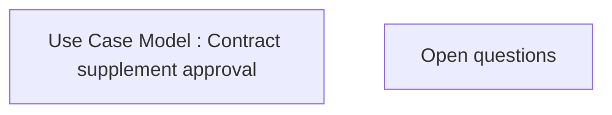

# CLM-95 (CBL-6) Restructuring - Phase 1

- **Diagram Type**: Custom
- **Package**: HomerSelect/BSL/Requirements Model/Finished/CLM/CLM-95 (CBL-6) Restructuring - Phase 1
- **Diagram ID**: 103170
- **Elements**: 2
- **Connectors**: 0

