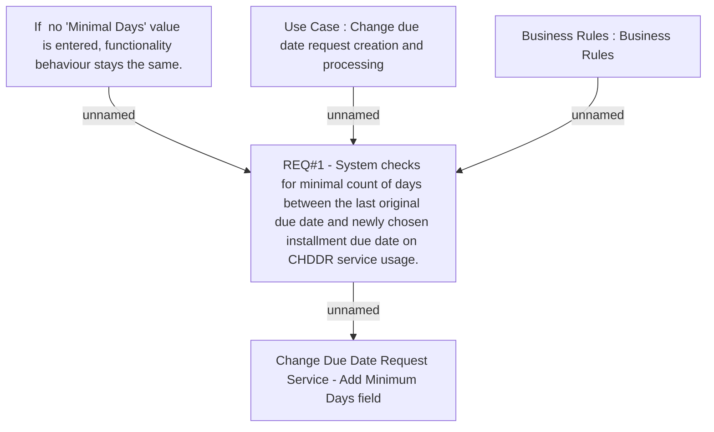

# CLM-952 (CBL-1934) Change Due Date Request Service - Add Minimum Days field

- **Diagram Type**: Custom
- **Package**: HomerSelect/BSL/Requirements Model/Finished/CLM/CLM-952 (CBL-1934) Change Due Date Request Service - Add Minimum Days field
- **Diagram ID**: 103470
- **Elements**: 5
- **Connectors**: 4

