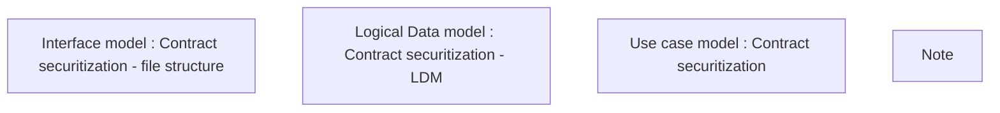

# CLM-97 (CBL-37) Securitization - 1st phase

```mermaid
graph TD
    Interface_model_Contract_securitization_file_structure["Interface model : Contract securitization - file structure "]
    Logical_Data_model_Contract_securitization_LDM["Logical Data model : Contract securitization - LDM"]
    Use_case_model_Contract_securitization["Use case model : Contract securitization"]
    el_1271037["Note"]
```
