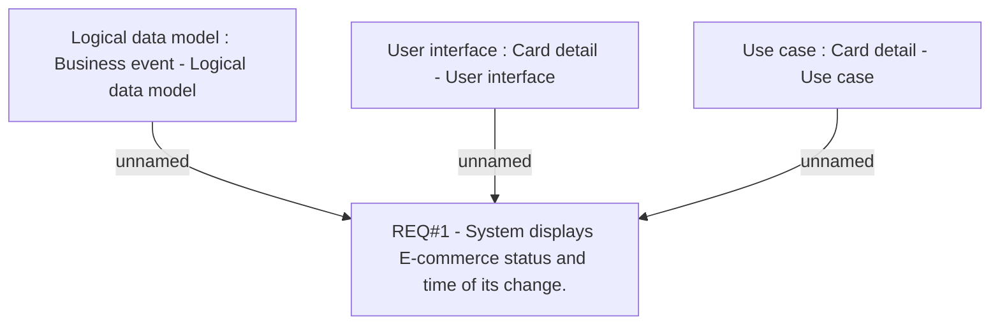

# CLM-98 (CBL-22) E-commerce status change

```mermaid
graph TD
    Use_case_Card_detail_Use_case["Use case : Card detail - Use case"]
    User_interface_Card_detail_User_interface["User interface : Card detail - User interface"]
    Logical_data_model_Business_event_Logical_data_model["Logical data model : Business event - Logical data model"]
    REQ_1_System_displays_E_commerce_status_and_time_of_its_chan["REQ#1 - System displays E-commerce status and time of its change."]
    Logical_data_model_Business_event_Logical_data_model -->|unnamed| REQ_1_System_displays_E_commerce_status_and_time_of_its_chan
    User_interface_Card_detail_User_interface -->|unnamed| REQ_1_System_displays_E_commerce_status_and_time_of_its_chan
    Use_case_Card_detail_Use_case -->|unnamed| REQ_1_System_displays_E_commerce_status_and_time_of_its_chan
```
