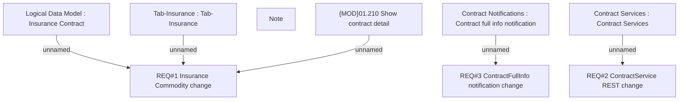

# CLM-99 (CBL-31) Commodity Module separation

- **Diagram Type**: Custom
- **Package**: HomerSelect/BSL/Requirements Model/Finished/CLM/CLM-99 (CBL-31) Commodity Module separation
- **Diagram ID**: 98786
- **Elements**: 9
- **Connectors**: 5

