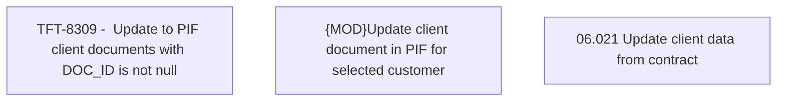

# TFT-8309 -  Update to PIF client documetns with DOC_ID is not null

```mermaid
graph TD
    TFT_8309_Update_to_PIF_client_documents_with_DOC_ID_is_not_n["TFT-8309 -  Update to PIF client documents with DOC_ID is not null"]
    MOD_Update_client_document_in_PIF_for_selected_customer["{MOD}Update client document in PIF for selected customer"]
    n_06_021_Update_client_data_from_contract["06.021 Update client data from contract"]
```
