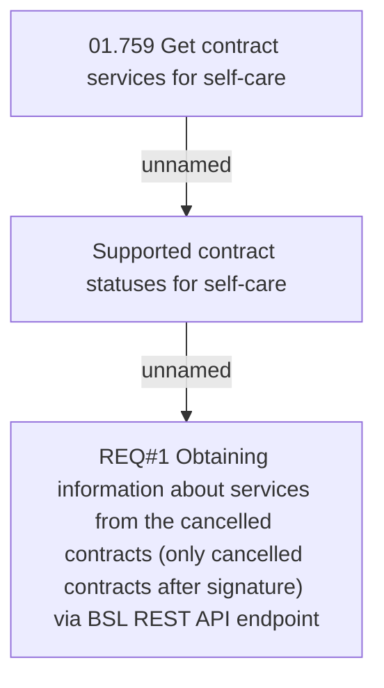

# BRPH-2066 (CSI-4207) Include Cancelled Status on BSL Endpoint

```mermaid
graph TD
    Supported_contract_statuses_for_self_care["Supported contract statuses for self-care"]
    n_01_759_Get_contract_services_for_self_care["01.759 Get contract services for self-care"]
    REQ_1_Obtaining_information_about_services_from_the_cancelle["REQ#1 Obtaining information about services from the cancelled contracts (only cancelled contracts after signature) via BSL REST API endpoint"]
    n_01_759_Get_contract_services_for_self_care -->|unnamed| Supported_contract_statuses_for_self_care
    Supported_contract_statuses_for_self_care -->|unnamed| REQ_1_Obtaining_information_about_services_from_the_cancelle
```
