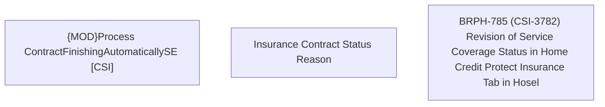

# BRPH-785 (CSI-3782) Revision of Service Coverage Status in Home Credit Protect Insurance Tab in Hosel

- **Diagram Type**: Custom
- **Package**: HomerSelect/BSL/Requirements Model/Finished/CSI/BRPH-785 (CSI-3782) Revision of Service Coverage Status in Home Credit Protect Insurance Tab in Hosel
- **Diagram ID**: 163507
- **Elements**: 3
- **Connectors**: 0

