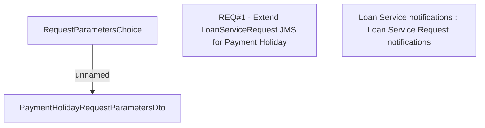

# CBL-10337 (CSI-62) Payhol Event Information - Loan Service Request LMS

- **Diagram Type**: Custom
- **Package**: HomerSelect/BSL/Requirements Model/Finished/CSI/CBL-10337 (CSI-62) Payhol Event Information - Loan Service Request LMS
- **Diagram ID**: 136447
- **Elements**: 4
- **Connectors**: 1

