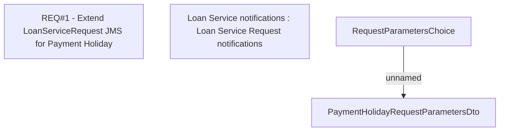

# CBL-10337 (CSI-62) Payhol Event Information - Loan Service Request LMS

```mermaid
graph TD
    REQ_1_Extend_LoanServiceRequest_JMS_for_Payment_Holiday["REQ#1 - Extend LoanServiceRequest JMS for Payment Holiday"]
    Loan_Service_notifications_Loan_Service_Request_notification["Loan Service notifications : Loan Service Request notifications"]
    PaymentHolidayRequestParametersDto["PaymentHolidayRequestParametersDto"]
    RequestParametersChoice["RequestParametersChoice"]
    RequestParametersChoice -->|unnamed| PaymentHolidayRequestParametersDto
```
