# CBL-10412 (CSI-209) BSL SNM component decommission

- **Diagram Type**: Custom
- **Package**: HomerSelect/BSL/Requirements Model/Finished/CSI/CBL-10412 (CSI-209) BSL SNM component decommission
- **Diagram ID**: 137241
- **Elements**: 9
- **Connectors**: 5

```mermaid
graph TD
    Use_case_model_Cardless_transaction_request_Use_case_model["Use case model : Cardless transaction request - Use case model"]
    Use_Case_Model_Insurance_based_on_EOM_event["Use Case Model : Insurance based on EOM event"]
    Use_Case_Model_Insurance_prolongation["Use Case Model : Insurance prolongation"]
    User_Interface_Model_Search_for_contract_package["User Interface Model : Search for contract package"]
    User_Interface_Model_Contract_package_detail["User Interface Model : Contract package detail"]
    CSI_865_Getting_Saleroom_name_for_Contract_package_tracking["CSI-865 Getting Saleroom name for Contract package tracking"]
    CSI_866_Cancel_getting_and_storage_Salesroom_in_Account_Tran["CSI-866 Cancel getting and storage Salesroom in Account Transaction table"]
    el_1615864["Note"]
    CSI_840_Getting_Salesroom_info_for_Card_management_support["CSI-840 Getting Salesroom info for Card management support"]
    User_Interface_Model_Contract_package_detail -->|unnamed| CSI_865_Getting_Saleroom_name_for_Contract_package_tracking
    User_Interface_Model_Search_for_contract_package -->|unnamed| CSI_865_Getting_Saleroom_name_for_Contract_package_tracking
    Use_Case_Model_Insurance_prolongation -->|unnamed| CSI_866_Cancel_getting_and_storage_Salesroom_in_Account_Tran
    Use_Case_Model_Insurance_based_on_EOM_event -->|unnamed| CSI_866_Cancel_getting_and_storage_Salesroom_in_Account_Tran
    Use_case_model_Cardless_transaction_request_Use_case_model -->|unnamed| CSI_866_Cancel_getting_and_storage_Salesroom_in_Account_Tran
```

