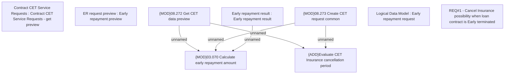

# CBL-10543 (CSI-170) Cancel Insurance possibility when loan contract is Early terminated

- **Diagram Type**: Custom
- **Package**: HomerSelect/BSL/Requirements Model/Finished/CSI/CBL-10543 (CSI-170) Cancel Insurance possibility when loan contract is Early terminated
- **Diagram ID**: 136448
- **Elements**: 9
- **Connectors**: 5

