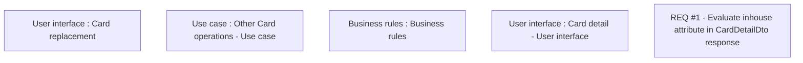

# CBL-10628 (CSI-206) [VN NASA] Transfer PIN option in case of replacement is not visible

- **Diagram Type**: Custom
- **Package**: HomerSelect/BSL/Requirements Model/Finished/CSI/CBL-10628 (CSI-206) [VN NASA] Transfer PIN option in case of replacement is not visible
- **Diagram ID**: 136449
- **Elements**: 5
- **Connectors**: 0

