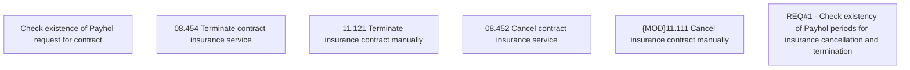

# CBL-10733 (CSI-171) Insurance cancellation and termination - check existing Payhol requests

- **Diagram Type**: Custom
- **Package**: HomerSelect/BSL/Requirements Model/Finished/CSI/CBL-10733 (CSI-171) Insurance cancellation and termination - check existing Payhol requests
- **Diagram ID**: 136450
- **Elements**: 6
- **Connectors**: 0

