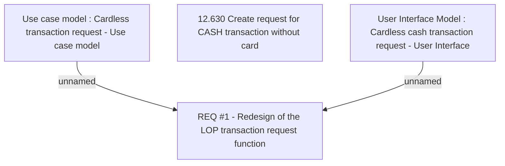

# CBL-10796 (CSI-218) New disbursement channel for LOP disbursement

- **Diagram Type**: Custom
- **Package**: HomerSelect/BSL/Requirements Model/Finished/CSI/CBL-10796 (CSI-218) New disbursement channel for LOP disbursement
- **Diagram ID**: 136451
- **Elements**: 4
- **Connectors**: 2

