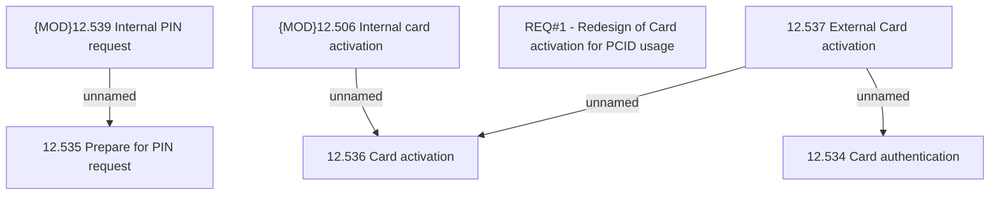

# CBL-10842 (CSI-182) Redesign of Card activation for PCID usage

```mermaid
graph TD
    n_12_535_Prepare_for_PIN_request["12.535 Prepare for PIN request"]
    n_12_536_Card_activation["12.536 Card activation"]
    MOD_12_539_Internal_PIN_request["{MOD}12.539 Internal PIN request"]
    MOD_12_506_Internal_card_activation["{MOD}12.506 Internal card activation"]
    REQ_1_Redesign_of_Card_activation_for_PCID_usage["REQ#1 - Redesign of Card activation for PCID usage"]
    n_12_537_External_Card_activation["12.537 External Card activation"]
    n_12_534_Card_authentication["12.534 Card authentication"]
    n_12_537_External_Card_activation -->|unnamed| n_12_534_Card_authentication
    n_12_537_External_Card_activation -->|unnamed| n_12_536_Card_activation
    MOD_12_506_Internal_card_activation -->|unnamed| n_12_536_Card_activation
    MOD_12_539_Internal_PIN_request -->|unnamed| n_12_535_Prepare_for_PIN_request
```
