# CBL-10922 (CSI-286) Rollback of executed Payhol request

- **Diagram Type**: Custom
- **Package**: HomerSelect/BSL/Requirements Model/Finished/CSI/CBL-10922 (CSI-286) Rollback of executed Payhol request
- **Diagram ID**: 136453
- **Elements**: 17
- **Connectors**: 3

```mermaid
graph TD
    Contract_Supplement_Status_Type["Contract Supplement Status Type"]
    Check_RollbackServiceRequest_input_parameters["Check RollbackServiceRequest input parameters"]
    n_01_821_Rollback_Loan_Service_Request_service["01.821 Rollback Loan Service Request service"]
    n_01_821_Rollback_Loan_Service_Request_service["01.821 Rollback Loan Service Request service"]
    Contract_Service_Request_Operation_Contract_Service_Request_["Contract Service Request Operation : Contract Service Request Operation"]
    Contract_Service_Requests_Contract_Service_Requests["Contract Service Requests : Contract Service Requests"]
    MOD_System_event_processing_setting["{MOD}System event processing setting"]
    REQ_1_Rollback_loan_service_request_by_GUI_and_API["REQ#1 - Rollback loan service request by GUI and API"]
    MOD_08_352_Process_LoanServiceRequestRollbackSE_event["{MOD}08.352 Process LoanServiceRequestRollbackSE event"]
    n_08_352_Process_LoanServiceRequestRollbackSE_event["08.352 Process LoanServiceRequestRollbackSE event"]
    MOD_Business_Event_Type["{MOD}Business Event Type"]
    n_08_351_Rollback_PAYHOL_loan_service_request["08.351 Rollback PAYHOL loan service request"]
    Check_availability_for_rollback_of_PAYHOL_request["Check availability for rollback of PAYHOL request"]
    User_Interface_ADD_Rollback_executed_service_request["User Interface : {ADD}Rollback executed service request"]
    n_08_351_Rollback_loan_service_request["08.351 Rollback loan service request "]
    n_08_351_Rollback_loan_service_request["08.351 Rollback loan service request"]
    User_Interface_Model_Tab_Collection_tools_requests_managemen["User Interface Model : Tab - Collection tools requests management"]
    n_01_821_Rollback_Loan_Service_Request_service -->|unnamed| n_01_821_Rollback_Loan_Service_Request_service
    n_01_821_Rollback_Loan_Service_Request_service -->|unnamed| Check_availability_for_rollback_of_PAYHOL_request
    n_01_821_Rollback_Loan_Service_Request_service -->|unnamed| Check_RollbackServiceRequest_input_parameters
```

