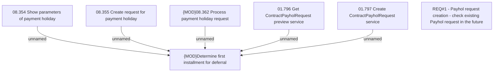

# CBL-11202 (CSI-349) Payhol request creation - check existing Payhol request in the future

- **Diagram Type**: Custom
- **Package**: HomerSelect/BSL/Requirements Model/Finished/CSI/CBL-11202 (CSI-349) Payhol request creation - check existing Payhol request in the future
- **Diagram ID**: 134979
- **Elements**: 7
- **Connectors**: 5

