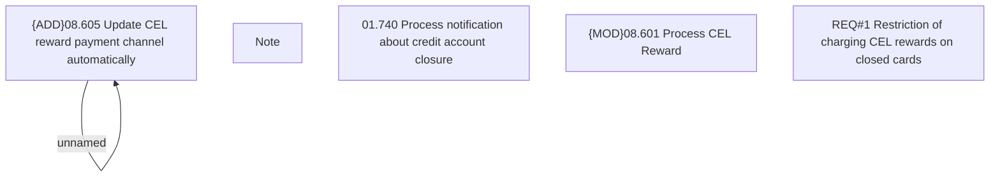

# CBL-11254 (CSI-575) Restriction of charging CEL rewards on closed cards

- **Diagram Type**: Custom
- **Package**: HomerSelect/BSL/Requirements Model/Finished/CSI/CBL-11254 (CSI-575) Restriction of charging CEL rewards on closed cards
- **Diagram ID**: 135704
- **Elements**: 6
- **Connectors**: 1

