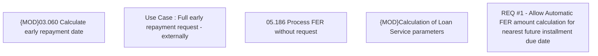

# CBL-11397 (CSI-406) Change FER Amount Calculation for Automatic FER processing

```mermaid
graph TD
    MOD_03_060_Calculate_early_repayment_date["{MOD}03.060 Calculate early repayment date"]
    Use_Case_Full_early_repayment_request_externally["Use Case : Full early repayment request - externally"]
    n_05_186_Process_FER_without_request["05.186 Process FER without request"]
    MOD_Calculation_of_Loan_Service_parameters["{MOD}Calculation of Loan Service parameters"]
    REQ_1_Allow_Automatic_FER_amount_calculation_for_nearest_fut["REQ #1 - Allow Automatic FER amount calculation for nearest future installment due date"]
```
