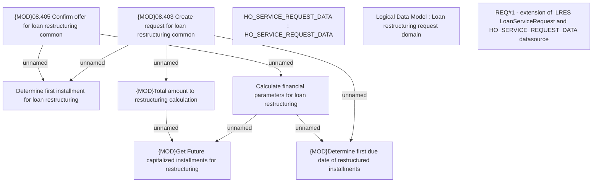

# CBL-11449 (CSI-314) Loan restructuring printout

- **Diagram Type**: Custom
- **Package**: HomerSelect/BSL/Requirements Model/Finished/CSI/CBL-11449 (CSI-314) Loan restructuring printout
- **Diagram ID**: 136455
- **Elements**: 10
- **Connectors**: 8

