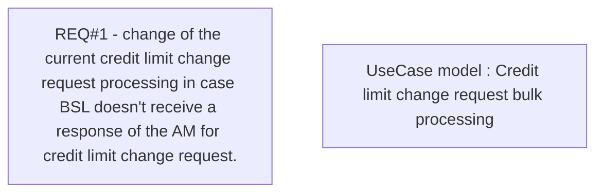

# CBL-11553 (CSI-341) Stop cancellation of requests for Credit limit change on processing timeout

- **Diagram Type**: Custom
- **Package**: HomerSelect/BSL/Requirements Model/Finished/CSI/CBL-11553 (CSI-341) Stop cancellation of requests for Credit limit change on processing timeout
- **Diagram ID**: 132740
- **Elements**: 2
- **Connectors**: 0

