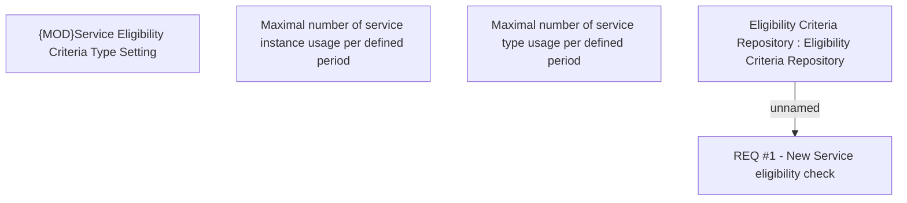

# CBL-11645 (CSI-383) Change Eligibility Container for PayHol Service

- **Diagram Type**: Custom
- **Package**: HomerSelect/BSL/Requirements Model/Finished/CSI/CBL-11645 (CSI-383) Change Eligibility Container for PayHol Service
- **Diagram ID**: 133499
- **Elements**: 5
- **Connectors**: 1

