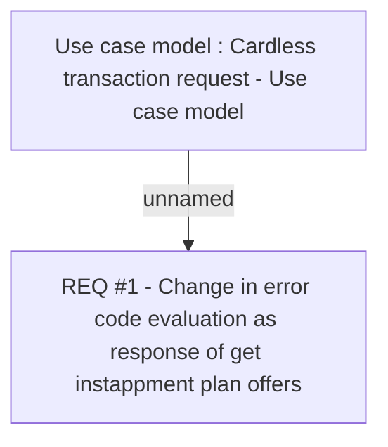

# CBL-11732 (CSI-403) Extension of UC12_630 error enumeration from AM response

```mermaid
graph TD
    Use_case_model_Cardless_transaction_request_Use_case_model["Use case model : Cardless transaction request - Use case model"]
    REQ_1_Change_in_error_code_evaluation_as_response_of_get_ins["REQ #1 - Change in error code evaluation as response of get instappment plan offers"]
    Use_case_model_Cardless_transaction_request_Use_case_model -->|unnamed| REQ_1_Change_in_error_code_evaluation_as_response_of_get_ins
```
