# CBL-12505 (CSI-1179) Service bundling support for cancellation and termination

- **Diagram Type**: Custom
- **Package**: HomerSelect/BSL/Requirements Model/Finished/CSI/CBL-12505 (CSI-1179) Service bundling support for cancellation and termination
- **Diagram ID**: 140160
- **Elements**: 18
- **Connectors**: 1

```mermaid
graph TD
    ADD_08_096_Cancel_contract_service_common["{ADD}08.096 Cancel contract service common"]
    ADD_08_091_Terminate_service_common["{ADD}08.091 Terminate service common"]
    MOD_08_091_Terminate_Contract_Service_common["{MOD}08.091 Terminate Contract Service common"]
    MOD_08_096_Cancel_contract_service_common["{MOD}08.096 Cancel contract service common"]
    MOD_System_event_processing_setting["{MOD}System event processing setting"]
    REQ_2_Create_a_new_UC_to_proces_ContractServiceChangedSE_sys["REQ#2 - Create a new UC to proces ContractServiceChangedSE system event and evaluate bundled services"]
    n_08_292_Process_Contract_Service_Change_event["08.292 Process Contract Service Change event"]
    ADD_08_292_Process_Contract_Service_Change_event["{ADD}08.292 Process Contract Service Change event"]
    REQ_1_Extend_ContractServiceChangedSE_by_new_parameters["REQ#1 - Extend ContractServiceChangedSE by new parameters"]
    n_11_126_Check_client_eligibility_for_insurance["11.126 Check client eligibility for insurance"]
    MOD_08_346_Add_Insurance_service_on_Contract_common["{MOD}08.346 Add Insurance service on Contract common"]
    n_08_080_Add_new_available_Service_on_Contract["08.080 Add new available Service on Contract"]
    MOD_01_774_Create_Contract_Service["{MOD}01.774 Create Contract Service"]
    n_11_773_Process_account_EOM_billing_finished_notification["11.773 Process account EOM billing finished notification"]
    MOD_08_095_Cancel_contract_service_manually["{MOD}08.095 Cancel contract service manually"]
    MOD_08_121_Terminate_contract_insurance_common["{MOD}08.121 Terminate contract insurance common"]
    n_08_111_Cancel_contract_insurance_common["08.111 Cancel contract insurance common"]
    n_08_090_Terminate_Contract_Service_manually["08.090 Terminate Contract Service manually"]
    n_11_773_Process_account_EOM_billing_finished_notification -->|unnamed| n_11_126_Check_client_eligibility_for_insurance
```

